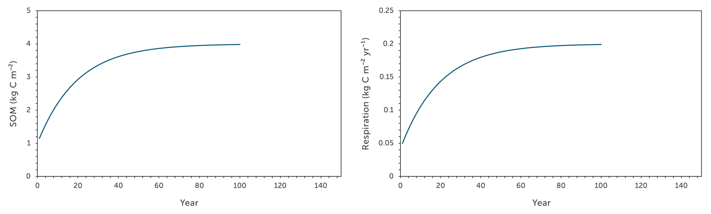
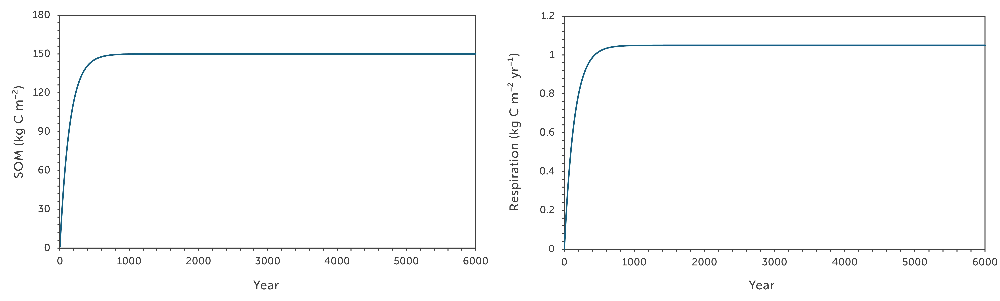
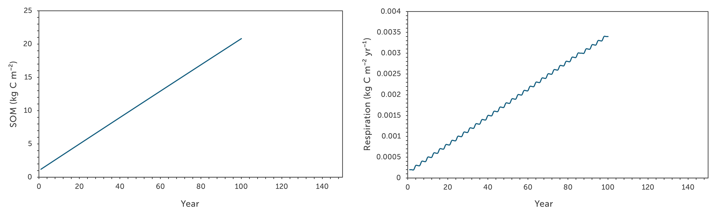

Date: **2025-05-06**

peat_v0 is the first version of a simple SOM decomposition model designed to simulate long-term carbon accumulation in peat soils. This version is deliberately minimal, developed to start the model framework with just the core components: **one layer, one SOM pool, one carbon input, and one decay (respiration) output**.

---

## Model Description

This is a **single-pool, first-order kinetic model** for soil organic matter (SOM), using the standard carbon mass balance:

dS/dt = I - k * S

Where:
- `S` = SOM stock (kg C m⁻²)
- `I` = input flux (kg C m⁻² yr⁻¹)
- `k` = decay constant (/yr)

Integration is performed with a 1-year timestep.

---

## Parameters and Justification

| Parameter      | Value            | Description & Source                                       |
|----------------|------------------|------------------------------------------------------------|
| `input_rate`   | 1.05 kg C/m²/yr   | Based on observed total NPP for Fenland reedbeds (Packer et al., 2017) |
| `k_decay`      | 0.007 /yr     | Derived numerically to match a carbon stock of 150 kg C/m² over 6000 years |
| `SOM_init`     | 0.0 kg C/m²      | Assumes peat accumulation starts from bare mineral surface |
| `nyears`       | 6000              | Matches estimated Fenland peat development timescale (Waller, 1994) |

---

## Output

The model prints annual values of:
- SOM pool size (kg C m⁻²)
- Input (kg C m⁻² yr⁻¹)
- Respired carbon (kg C m⁻² yr⁻¹)

This output allows for quick verification that the model behaves as expected and conserves mass.

---

## Results

The result is shown in the graph below. The notable points from this implementation are:

- The **original model** (`k = 0.05 yr⁻¹`) converges to an equilibrium of by ~90 years.
- The **updated model** with parameters (`k = 0.007 yr⁻¹`, `input_rate = 1.05 kg C/m²/yr`, `SOM = 0.0 kg C/m²`, `nyears = 6000`) allows equilibrium to be approached within the 6000-year window, without assuming the system is already at steady state.

The attached figure shows 1) Original model and 2) Updated model:

- **Left panel**: SOM pool (kg C m⁻²) over time.
- **Right panel**: Annual respiration flux (kg C m⁻² yr⁻¹).

**Original model**

**Updated model**

---

## Decay Constant Derivation (Updated)

The decay constant was derived to satisfy the analytical solution:

S(t) = (I / k) * (1 - exp(-k * t))

Where:
- I = 1.05 kg C m⁻² yr⁻¹  (input rate based on NPP)
- S(t = 6000) = 150 kg C m⁻²  (observed peat C stock)
- S₀ = 0  (initial condition))

Solving numerically gives:
- **k = 0.007 yr⁻¹**

This decay rate provides a realistic simplification for single-pool dynamics, consistent with gradual but ongoing accumulation observed in modern Fenland peatlands.

## Mass Conservation Check

To verify the model conserves carbon mass, the model track total input, total CO₂ respiration, and final SOM stock over the full simulation period:
The check was implemented in the code by summing:
- Total litter input
- Total C lost to respiration
- Final SOM pool

And verifying:
Total Input ≈ Total Respired + Final SOM

For the current parameters:
 - Total C input: 6299.72 kg C/m²
 - Total C respired: 6149.73 kg C/m²
 - Final SOM stock: 150.00 kg C/m²
 - Residual: -0.01 kg C/m²

This may confirms that **carbon mass is conserved** to within 0.01 kg C/m2 over 6000 years, with minor discrepancy which is suspected due to floating point rounding.

---

Date: **2025-04-30**

## Parameters and Justification

| Parameter      | Value            | Description & Source                                       |
|----------------|------------------|------------------------------------------------------------|
| `input_rate`   | 0.2 kg C/m²/yr   | Chosen for testing. Roughly reflects a modest litter input rate for a semi-productive organic soil, e.g., in a partially rewet or degraded fen. This value is conservative; natural Fenland inputs are closer to 500–1000 g C/m²/yr (Packer et al., 2017; Stout, 1971). |
| `k_decay`      | 0.000167 /yr     | **Updated decay constant** based on field data (see below). Much slower decay. |
| `SOM_init`     | 1.0 kg C/m²      | Arbitrary initial condition for testing. As expected, the model converges to a steady-state stock of I/k = 4.0 kg C/m². |
| `nyears`       | 100              | Run length chosen to approach equilibrium (~98% of steady state is reached in 88 years with this k). |

---

## Output

The model prints annual values of:
- SOM pool size (kg C m⁻²)
- Input (kg C m⁻² yr⁻¹)
- Respired carbon (kg C m⁻² yr⁻¹)

This output allows for quick verification that the model behaves as expected and conserves mass.

---

## Results

The result is shown in the graph below. The notable points from this implementation are:

- The **original model** (`k = 0.05 yr⁻¹`) converges to an equilibrium of by ~90 years.
- The **updated model** (`k = 0.000167 yr⁻¹`) accumulates slowly and remains far from equilibrium after 100 years.

The attached figure shows 1) Original model and 2) Updated `k_decay` model:

- **Left panel**: SOM pool (kg C m⁻²) over time.
- **Right panel**: Annual respiration flux (kg C m⁻² yr⁻¹).

**Original model**

**Updated model**

---

## Decay Constant Derivation (Updated)

From field estimates:

- **Peat C stock** ≈ 150 kg C/m²  
- **Long-term C accumulation** ≈ 25 g C/m²/yr
- Using: k = I / S = 0.025 / 150 ≈ 1.67 × 10⁻⁴ yr⁻¹

This value matches literature estimates for long-term decay in catotelm peat (Yu, 2011; Clymo, 1984).

---

Date: **2025-04-30**

## Parameters and Justification

| Parameter      | Value       | Description & Source                                      |
|----------------|-------------|------------------------------------------------------------|
| `input_rate`   | 0.2 kg C/m²/yr | Chosen for testing. Roughly reflects a modest litter input rate for a semi-productive organic soil, e.g., in a partially rewet or degraded fen. This value is conservative; natural Fenland inputs are closer to 500–1000 g C/m²/yr (Packer et al., 2017; Stout, 1971). |
| `k_decay`      | 0.05 /yr     | Represents a moderate SOM turnover rate, corresponding to a half-life of ~14 years. This is faster than passive peat but slower than active microbial pools. Chosen as a simplified representation of combined aerobic + anaerobic decay. |
| `SOM_init`     | 1.0 kg C/m²  | Arbitrary initial condition for testing. As expected, the model converges to a steady-state stock of I/k = 4.0 kg C/m². |
| `nyears`       | 100          | Run length chosen to approach equilibrium (~98% of steady state is reached in 88 years with this k). |

---

## Results

The result is shown in the graph below. The notable points from this implementation are:

- **SOM (Soil Organic Matter)** increases over time and asymptotically approaches a steady-state value of **4.0 kg C m⁻²**.
- **Respiration flux** also increases over time and stabilizes at the same rate as the input (0.2 kg C m⁻² yr⁻¹), confirming the system reaches equilibrium.
- The model reaches approximately **98% of equilibrium** by **year 88**, making 100 years a useful reference for steady-state behavior under these parameters.

The attached figure shows:

- **Left panel**: SOM pool (kg C m⁻²) over time.
- **Right panel**: Annual respiration flux (kg C m⁻² yr⁻¹).

---

## Purpose

This version is a **toy model**, used to:
- Check that the code framework is working as expected.
- Explore basic dynamics of SOM accumulation and loss.
- Serve as a baseline before adding complexity (e.g., multiple pools, depth layers, or environmental controls).

It is not yet parameterized for real-world Fenland peatlands. That will require updated values for input, decay rate, and time horizon based on observational data (see Yu, 2011; Waller, 1994; Peacock et al., 2019).

---

## References

- **Packer, J.G., et al. (2017)**. Biological Flora of the British Isles: *Phragmites australis*. *Journal of Ecology*, 105(4), 1123–1145.
- **Stout, J.D. (1971)**. Aspects of the microbiology and oxidation of Wicken Fen soil. *Soil Biology & Biochemistry*, 3(1), 9–25.
- **Yu, Z. (2011)**. Holocene carbon flux histories of the world’s peatlands. *The Holocene*, 21(5), 761–774.
- **Waller, M.P. (1994)**. *Flandrian Environmental Change in Fenland*. East Anglian Archaeology Monograph 70.
- **Peacock, M., et al. (2019)**. The full carbon balance of a rewetted cropland fen and a conservation-managed fen. *Agric. Ecosyst. Environ.*, 269, 1–12.
- **Clymo, R.S. (1984)**. The limits to peat bog growth. *Phil. Trans. R. Soc. B*, 303(1117), 605–654.
